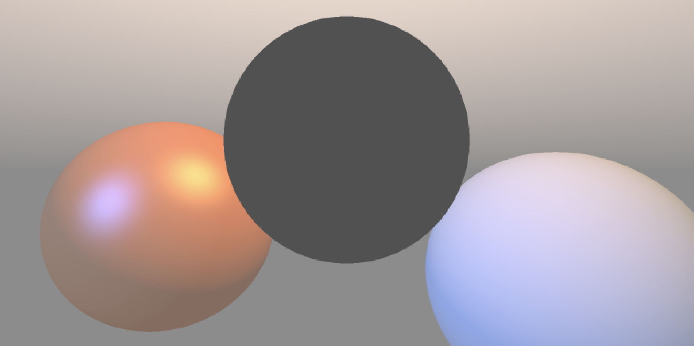
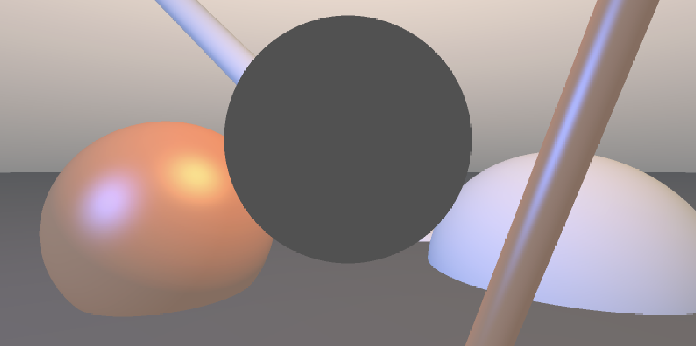
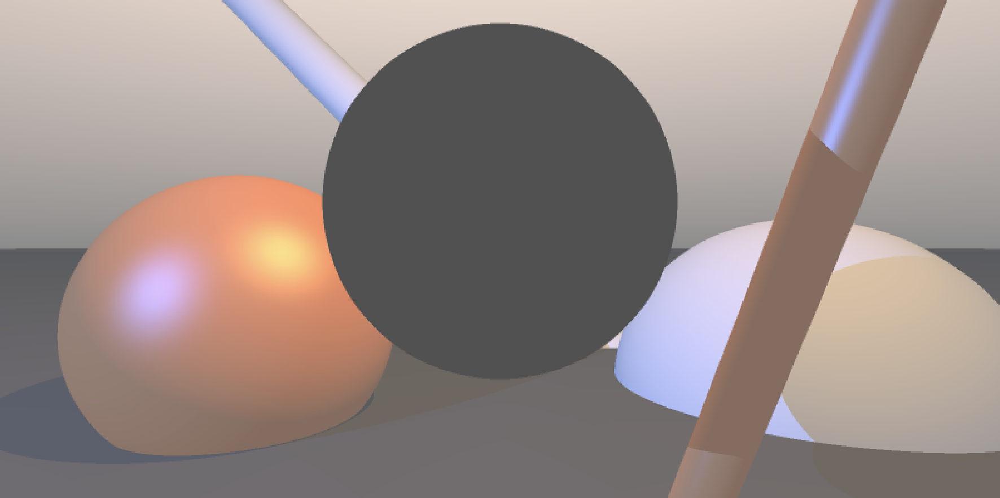
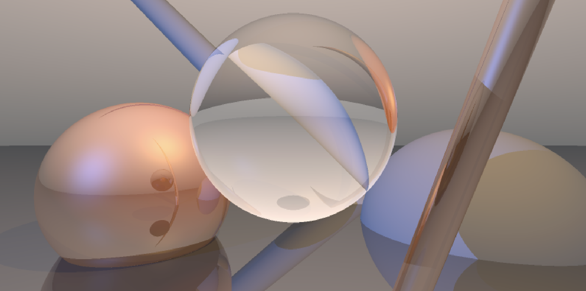
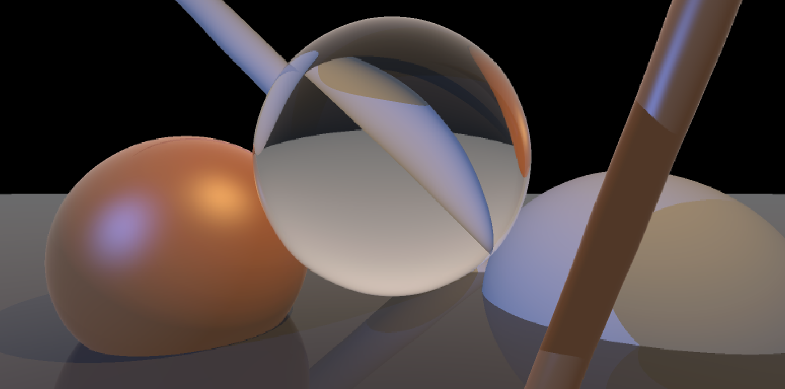
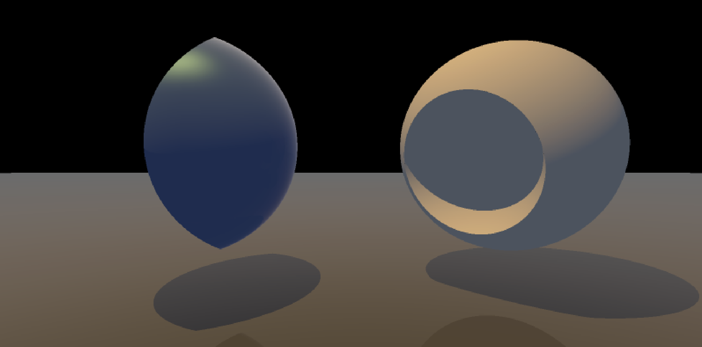

# Ray Tracing with WebGL
A ray tracer implemented in **WebGL** and **GLSL** as part of the UCL Computer Graphics coursework.

The project progressively extends a basic ray tracer by implementing geometric intersections, lighting, recursive ray tracing, transparent materials and Constructive Solid Geometry (CSG)

---

## Features

- Ray–sphere intersection
- Ray–plane intersection
- Ray–cylinder intersection
- Phong illumination model
- Hard shadows using shadow rays
- Recursive reflections
- Refraction using Snell's law
- Fresnel effect using Schlick's approximation
- Constructive Solid Geometry (Boolean operations)

---

## Technologies

- WebGL
- GLSL (Fragment Shader)
- JavaScript

---

# Results

## 1. Original Scene

The initial scene containing the basic geometric primitives and Phong shading.



---

## 2. Geometry Intersections

Support for sphere, plane and cylinder intersection tests.



---

## 3. Shadow Rays

Hard shadows are generated by tracing shadow rays from the intersection point towards the light source.



---

## 4. Reflection

Recursive ray tracing is used to compute mirror reflections on reflective materials.



---

## 5. Refraction and Fresnel

Transparent materials are implemented using **Snell's Law**, while the reflectance is approximated using **Schlick's Fresnel approximation**.



---

## 6. Boolean Operations

Constructive Solid Geometry (CSG) is implemented to create complex implicit shapes by combining primitive objects using Boolean operations.



---

# Implementation

The renderer follows the standard recursive ray tracing pipeline:

1. Generate a primary ray for every pixel.
2. Compute the nearest intersection with scene geometry.
3. Evaluate Phong illumination.
4. Cast shadow rays for visibility testing.
5. Recursively compute reflected rays.
6. Recursively compute refracted rays.
7. Blend reflection and refraction using Fresnel coefficients.
8. Return the final pixel colour.

---

# Project Structure

```text
ray-tracing-webgl/
│
├── README.md
├── images/
│   ├── original.png
│   ├── geometry.png
│   ├── shadow.png
│   ├── reflection.png
│   ├── refraction_fresnel.png
│   └── boolean_geometry.png
├── ray_tracing.uclcg
```

---

# Learning Outcomes

Through this project I implemented and gained experience with:

- GPU fragment shader programming
- Ray-object intersection algorithms
- Recursive ray tracing
- Reflection and refraction
- Fresnel reflectance
- Constructive Solid Geometry (CSG)
- Physically-inspired illumination models

---

